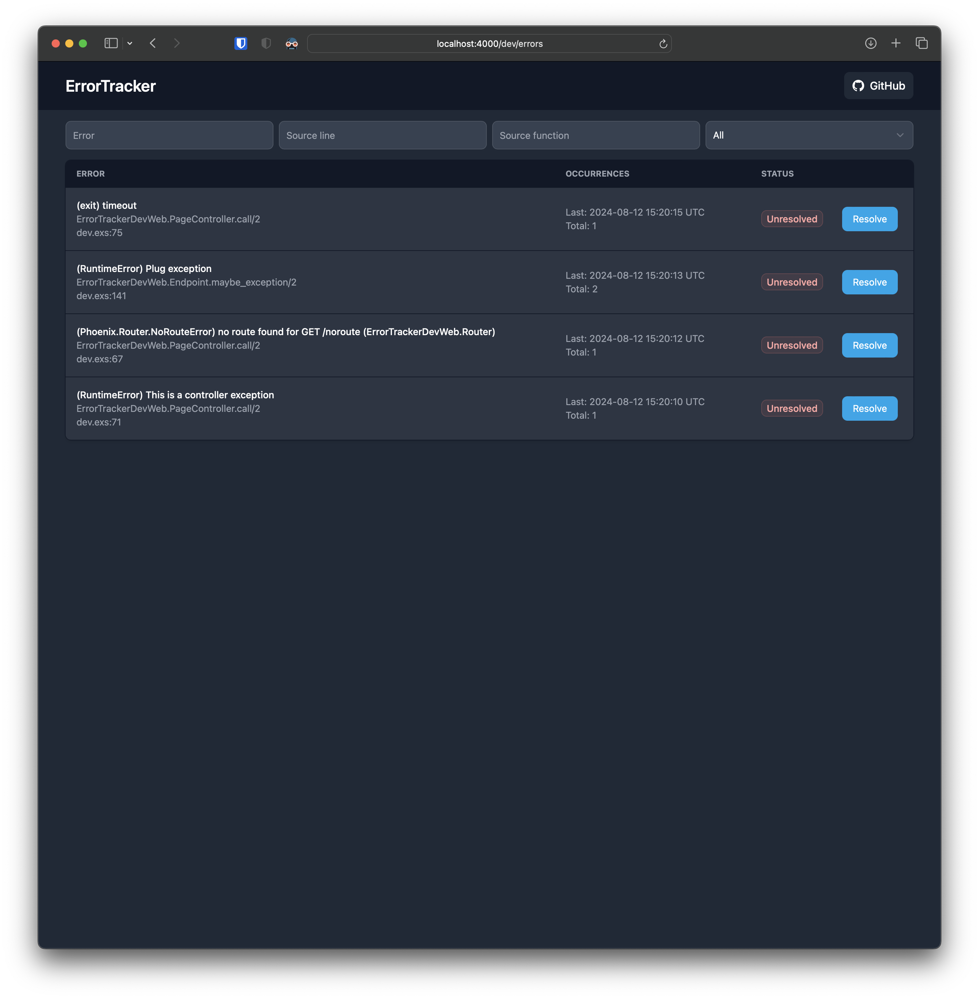
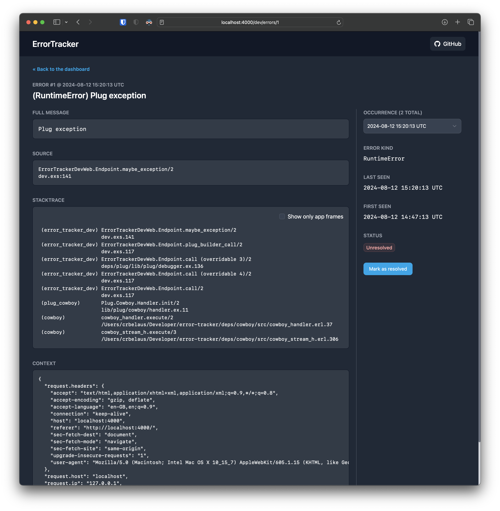

# 🐛 ErrorTracker

<a title="GitHub CI" href="https://github.com/elixir-error-tracker/error-tracker/actions"></a>
<a title="Latest release" href="https://hex.pm/packages/error_tracker"></a>
<a title="View documentation" href="https://hexdocs.pm/error_tracker"></a>

**An Elixir based built-in error tracking solution.**

ErrorTracker captures errors in your application and stores them in the database. It also provides a web dashboard from where you can find, inspect and resolve captured errors.

**Does it send notifications or integrate with issue trackers?**

ErrorTrackers's goal is to track errors. Period. It provides a nice Telemetry integration that you can attach to and use to send notifications, open tickets in your issue tracker and whatnot.

**Why another error tracker?**

While there are multiple SaaS error trackers available, this is the only Elixir-native built-in error tracker that runs as part of your application. It gives you full control over where, how and what data is stored so it is always on your control and doesn't leave your system.\
You can see a more detailed explanation [here](https://crbelaus.com/2024/07/31/built-in-elixir-error-reporting-tracking).

<a href="guides/screenshots/error-dashboard.png">
  
</a>
<a href="guides/screenshots/error-detail.png">
  
</a>

## Configuration

Take a look at the [Getting Started](/guides/Getting%20Started.md) guide.

## Development

### Initial setup and dependencies

If this is the first time that you set up this project you will to generate the configuration files and adapt their content to your local environment:

```
cp config/dev.example.exs config/dev.exs
cp config/test.example.exs config/test.exs
```

Then, you will need to download the dependencies:

```
mix deps.get
```

### Assets

In order to participate in the development of this project, you may need to know how to compile the assets needed to use the Web UI.

To do so, you need to first make a clean build:

```
mix do assets.install, assets.build
```

That task will build the JS and CSS of the project.

The JS is not expected to change too much because we rely in LiveView, but if
you make any change just execute that command again and you are good to go.

In the case of CSS, as it is automatically generated by Tailwind, you need to
start the watcher when your intention is to modify the classes used.

To do so you can execute this task in a separate terminal:

```
mix assets.watch
```


### Development server

We have a `dev.exs` script based on [Phoenix Playground](https://github.com/phoenix-playground/phoenix_playground) that starts a development server.

```
iex dev.exs
```
